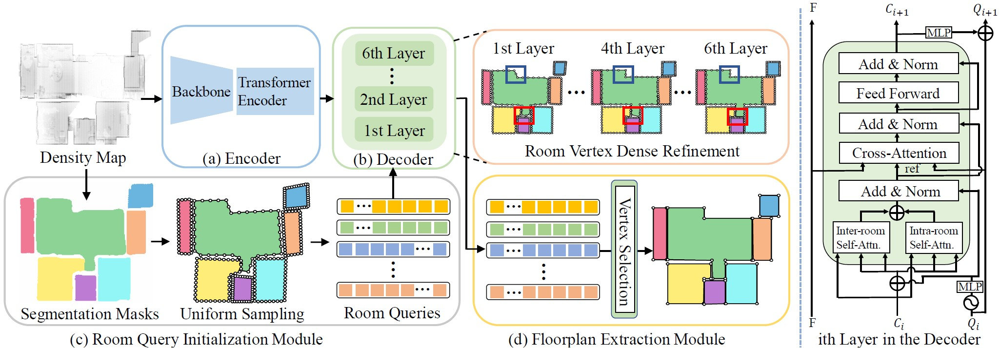

# [ECCV2024] PolyRoom: Room-aware Transformer for Floorplan Reconstruction
Official implementation of 'PolyRoom: Room-aware Transformer for Floorplan Reconstruction'.   
Please keep tuned and we will release the code soon!
## Abstract
Reconstructing geometry and topology structures from raw unstructured data has always been an important research topic in indoor mapping research. 
In this paper, we aim to reconstruct the floorplan with a vectorized representation from point clouds. 
Despite significant advancements achieved in recent years, current methods still encounter several challenges, such as missing corners or edges, inaccuracies in corner positions or angles, self-intersecting or overlapping polygons, and potentially implausible topology. 
To tackle these challenges, we present PolyRoom, a room-aware Transformer that leverages uniform sampling representation, room-aware query initialization, and room-aware self-attention for floorplan reconstruction. 
Specifically, we adopt a uniform sampling floorplan representation to enable dense supervision during training and effective utilization of angle information. Additionally, we propose a room-aware query initialization scheme to prevent non-polygonal sequences and introduce room-aware self-attention to enhance memory efficiency and model performance. 
Experimental results on two widely used datasets demonstrate that PolyRoom surpasses current state-of-the-art methods both quantitatively and qualitatively. 
## Method

**Overall architecture of PolyRoom.** PolyRoom consists of four main components: (a) Encoder module, (b) Decoder module, (c) Room-aware query initialization module, and (d) Floorplan extraction module. Room queries are initialized with instance segmentation. Subsequently,  they are refined in the Transformer decoder layer by layer with dense supervision (red and blue boxes mark the changes). Finally, the floorplan is extracted based on vertex selection. The detailed structure of the $i$th layer in the Transformer decoder is depicted in the right part, where $F$ denotes the output of the Transformer encoder, $C_i$, $C_{i+1}$ represent content queries from different layers, while $Q_i$, $Q_{i+1}$ denote room queries from different layers.

## Environment, dataset, and runnning
Please refer to [RoomFormer](https://github.com/ywyue/RoomFormer/) and * [MMdetection](https://github.com/open-mmlab/mmdetection) for environment setting, dataset preparation and code running.

## Acknowledgment
We thank the authors of RoomFormer, HEAT, and MonteFloor for providing results for better comparison. We also thank the following excellent projects especially RoomFormer:
* [RoomFormer](https://github.com/ywyue/RoomFormer/)
* [DETR](https://github.com/facebookresearch/detr)
* [Deformable-DETR](https://github.com/fundamentalvision/Deformable-DETR)
* [Detectron2](https://github.com/facebookresearch/detectron2)
* [HEAT](https://github.com/woodfrog/heat)
* [BoundaryFormer](https://github.com/mlpc-ucsd/BoundaryFormer)
* [MMdetection](https://github.com/open-mmlab/mmdetection)

